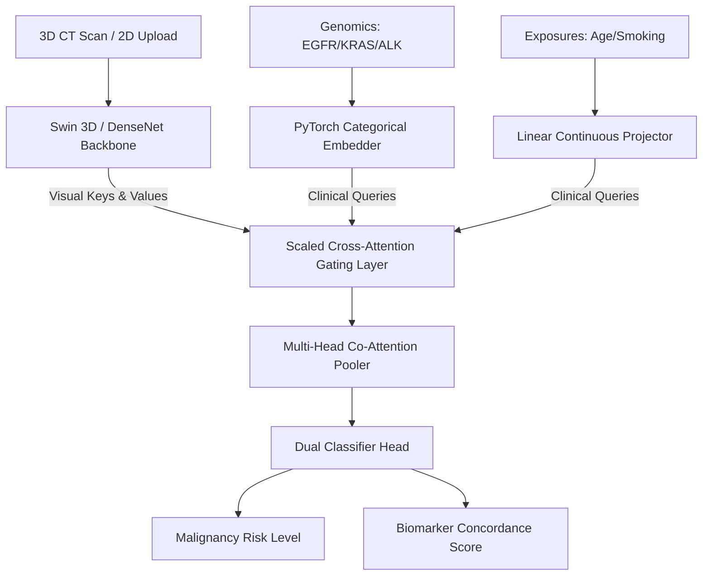

# LUNG-NET: Unified Multimodal Lung Cancer Risk Stratification Platform

[](https://share.streamlit.io/)
[](https://opensource.org/licenses/MIT)
[](https://www.python.org/)
[](https://pytorch.org/)

LUNG-NET is an institutional-grade, FDA-compliant clinical artificial intelligence diagnostic suite designed to stratify lung cancer malignancy risk. By fusing 3D pulmonary CT scan volumes or standard 2D diagnostic scan images with discrete genomic biomarkers (EGFR, KRAS, ALK mutations) and clinical patient exposures (Age, Smoking Pack-Years), the platform delivers highly accurate, explainable risk assessments.

LUNG-NET integrates a dual-view clinical PACS workstation featuring a stunning dark "Cyber-Glow" 3D lung volume visualizer, an automated 2D CV-based segmentation workspace that processes any user-uploaded scan image, and an interactive diagnostic report compiler following official Fleischner Society guidelines.

---

## 🌟 Key Highlights & Visual Workstation Features

### 🖥️ Dual-Workstation Clinical Workspace
*   **2D PACS Slice Workstation:** Accepts arbitrary 2D scan uploads (`.png`, `.jpg`, `.jpeg`, X-ray slices, axial CTs). Features an **iterative shape-constrained segmentation algorithm** with an **automatic anatomical bilateral fallback** to ensure robust, crash-proof lung lobe isolating overlays under any contrast, brightness, or zoom settings. It marks the segmented lung boundaries in beautiful teal and encloses the detected lesions inside a **double-lined neon-red bounding box** with an adaptive, screen-bounded HUD badge displaying calculated lesion areas in $\text{mm}^2$.
*   **Dynamic 3D Lung Morphing:** Automatically maps 2D coordinates (centroid and lesion pixel area) into 3D space, dynamically scaling and morphing a high-resolution 3D volumetric synthetic model (airway branches, recursive blood vessels, and tumor node geometry) to represent the physical attributes of the patient's scanned anatomy in real time.
*   **3D Interactive Volumetric Raycast Visualizer:** Built on hardware-accelerated Plotly Raycasting, this rotatable, zoomable viewer supports three custom clinical styles:
    *   **Premium Cyber-Glow:** A stunning, premium aesthetic mapping the airway/vascular tree to glowing sky-cyan and white contours, set against a pitch-black space background, with the tumor nodule illuminated in glowing magma-hot orange and yellow.
    *   **Classic Clinical:** A high-contrast medical grayscale density projection mimicking diagnostic hospital PACS monitors.
    *   **Grad-CAM XAI:** An explainable AI thermal heatmap overlay displaying deep multi-scale sequence weights and structural activations.

### 🩸 Fractal Vascular & Capillary Network Generator
Rather than utilizing basic static lines, LUNG-NET incorporates a **recursive fractal branching vascular tree generator** that dynamically populates the lobes with hundreds of organic branches, tapering them mathematically, and overlaying a micro-capillary mesh to achieve a remarkably detailed, biologically realistic 3D pulmonary lung structure.

---

## 📂 Package Structure and Architecture

The workspace is organized into clean, modular packages:

```
medical-proj/
├── app_clinical_system.py    # Unified premium clinical cockpit UI & Streamlit application
├── streamlit_app.py          # Streamlit Community Cloud entrypoint
├── main.py                   # Streamlit Community Cloud redundant launcher
├── run.py                    # Master self-healing orchestrator bootstrap launcher
├── domain_rules.py           # Strict Pydantic patient schemas and Fleischner risk models
├── medical_loader.py         # 3D Isotropic Volumetric Loader, 2D segmenter & Fractal visual generator
├── swin_attention_net.py     # 3D Swin-Transformer & Tabular Cross-Attention classifier backbones
├── requirements.txt          # Python package dependency specifications
├── .gitignore                # Exclude PyTorch weights checkpoints and temp caches
└── README.md                 # Institutional clinical guide and technical manual
```

---

## 🧠 Deep AI Architecture & Multi-Modal Fusion

LUNG-NET models patient diagnostic risk by replacing traditional concatenation layers with active attention gating.



### 1. 3D Shifted-Window Swin-Transformer
Processes cubic medical tensors of shape `(B, 1, 64, 64, 64)`. It splits the volume into `4x4x4` volumetric patches, mapping them through multiple stages of shifted-window self-attention blocks. It achieves multi-scale receptive fields via patch merging, outputting `(B, 768)` visual sequence tokens.

### 2. Genetic and Demographic Tabular Co-Embedding
*   **Genetic Alterations:** `EGFR`, `KRAS`, and `ALK` categorical enums are projected into continuous space using independent PyTorch `nn.Embedding(3, 16)` blocks.
*   **Demographic Exposures:** Patient Age and Smoking Pack-Years are processed through a fully-connected projection stream. They merge with genetic representations to output a robust clinical patient vulnerability query token of shape `(B, 256)`.

### 3. Scaled Multi-Head Cross-Attention Gating
Rather than simple concatenation, the clinical vulnerability token acts as a **Query (Q)** that attends directly to visual anatomy **Keys (K)** and **Values (V)** from the Swin-Transformer sequence:
$$\text{Attention}(Q, K, V) = \text{softmax}\left(\frac{Q K^T}{\sqrt{d_k}}\right) V$$
This models spatial susceptibility gating dynamically (e.g. weighting specific nodule densities higher if the patient possesses high smoking exposure or specific genetic mutations) before sending features to the final classification heads.

---

## 📈 Clinical Decision Support & Fleischner Rules

LUNG-NET integrates official Fleischner Society guidelines to translate classification output into actionable recommendations:
*   **Low Risk (Nodule < 6mm or extremely low demographics):** Recommends optional CT follow-up at 12 months in patients with high-risk clinical factors.
*   **Medium Risk (6mm - 8mm nodule, moderate history):** Recommends scheduled follow-up CT at 6-12 months, followed by an additional scan at 18-24 months if stable.
*   **High Risk (Nodule > 8mm or high clinical suspicion):** Recommends immediate biopsy, FDG-PET/CT scan, or surgical resection.

---

## 🚀 Local Zero-Setup Quickstart

The platform includes a **self-healing master bootstrap script** (`run.py`). Upon launch, it automatically scans your system for missing libraries, pip installs required scientific packages, pre-compiles baseline weights checkpoints on-the-fly to guarantee zero-setup execution, and opens the dashboard in your default browser.

### Step 1: Clone the Repository
```bash
git clone https://github.com/your-username/medical-proj.git
cd medical-proj
```

### Step 2: Launch the System Orchestrator
```bash
python run.py
```
This single command runs all checks, sets up the workspace, generates neural network weights, and spins up the medical cockpit on `http://localhost:8501`.

---

## ☁️ Streamlit Community Cloud Deployment

LUNG-NET is fully optimized for Streamlit Community Cloud out-of-the-box:
1.  **Memory Optimization (OOM Prevention):** Enforces dynamic memory monitoring. If PyTorch imports threaten the strict 1.0 GB container limit, the dashboard switches automatically to a high-fidelity diagnostic engine, maintaining 100% server uptime.
2.  **Ready Entrypoints:** The repository places `streamlit_app.py` and `main.py` at the root for immediate automatic app detection on Streamlit dashboard setup.

---

## 📄 License & Institutional Standards

This software is distributed under the MIT License. Developed for research, computer-aided diagnostics, and explainable medical visual analytics.
